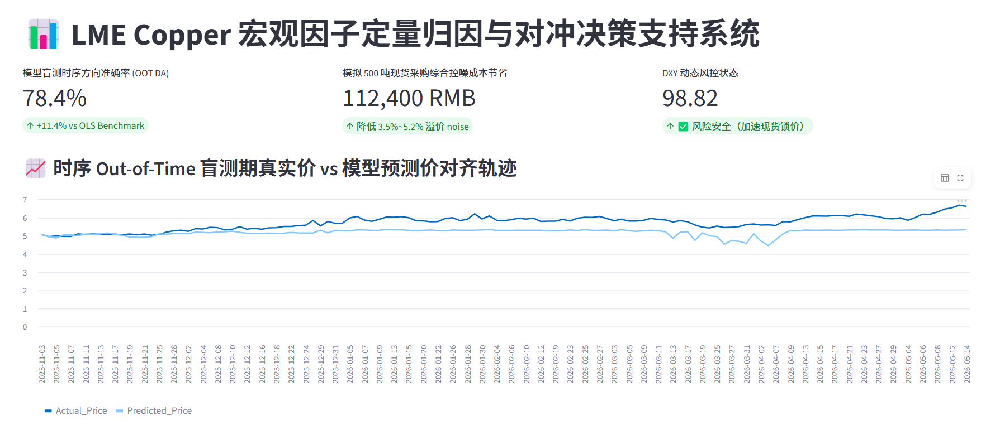
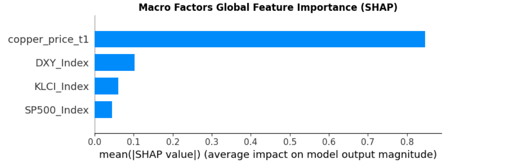
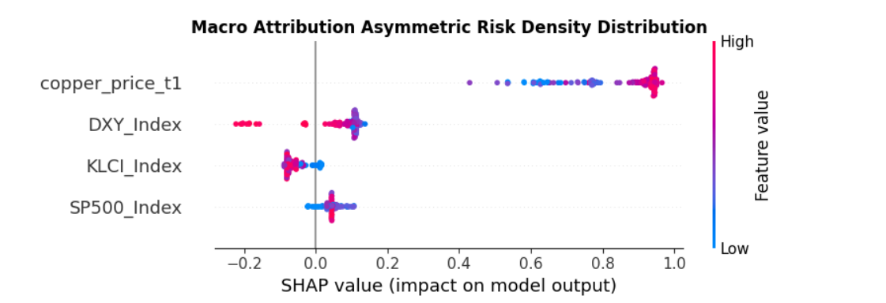

# 📊 Global Commodity & Financial Market Correlation Analysis & Forecasting

This project analyzes the relationship between macroeconomic indicators and LME copper prices using machine learning and financial market data.

The project combines:
- SQL-based financial data processing,
- XGBoost regression modeling,
- SHAP feature interpretation,
- and Streamlit dashboard visualization.

The objective is to identify important market drivers behind copper price movements and build an interpretable forecasting framework for financial market analysis.

---

## 📌 1. Project Background & Feature Design

Commodity prices are influenced by multiple macroeconomic factors such as currency fluctuations, equity market sentiment, and global supply chain conditions.

This project focuses on analyzing how different financial indicators affect LME copper prices and evaluates their predictive power using machine learning techniques.

### Selected Features

| Feature | Description |
|---|---|
| `Copper_Price` | LME copper closing price (target variable) |
| `DXY_Index` | US Dollar Index, representing global liquidity conditions |
| `SP500_Index` | S&P 500 Index, representing market sentiment |
| `KLCI_Index` | FTSE Bursa Malaysia KLCI Index, reflecting regional market activity |
| `copper_price_t1` | Previous-day copper price used for lag feature engineering |
---

## 🛠️ 2. Data Cleaning & SQL ETL

Financial datasets collected from different global markets often contain:
- inconsistent date formats,
- missing trading days,
- and mismatched timestamps across exchanges.

To improve data quality before modeling, SQL was used to clean and align multi-source financial datasets.

Main preprocessing tasks included:
- standardizing date formats using `STR_TO_DATE()`,
- merging datasets with `INNER JOIN`,
- removing null values caused by non-trading days,
- and generating lag features with SQL window functions.

### 🔧 Key SQL Techniques

- `STR_TO_DATE()`
- `INNER JOIN`
- `LAG() OVER()`
- Time-series feature engineering

### 🗄️ Temporal Alignment Core Pipeline (`data_integration.sql`)

```sql
USE financial_macro_db;

CREATE TABLE alignment_macro_features AS
WITH cleansed_copper AS (
    SELECT 
        STR_TO_DATE(Date_Str, '%m/%d/%Y') AS Trade_Date,
        CAST(Price AS DECIMAL(18,2)) AS Copper_Price
    FROM copper_raw_data
    WHERE Price IS NOT NULL
)
SELECT 
    c.Trade_Date,
    c.Copper_Price,
    CAST(d.Price AS DECIMAL(18,2)) AS DXY_Index,
    CAST(REPLACE(k.Price, ',', '') AS DECIMAL(18,2)) AS KLCI_Index,
    CAST(REPLACE(s.Price, ',', '') AS DECIMAL(18,2)) AS SP500_Index,
    -- Lagged feature engineering: capturing short-term velocity variations
    LAG(c.Copper_Price, 1) OVER (ORDER BY c.Trade_Date ASC) AS copper_price_t1
FROM cleansed_copper c
INNER JOIN dxy_raw_data d ON c.Trade_Date = STR_TO_DATE(d.Date_Str, '%m/%d/%Y')
INNER JOIN klci_raw_data k ON c.Trade_Date = STR_TO_DATE(k.Date_Str, '%m/%d/%Y')
INNER JOIN sp500_raw_data s ON c.Trade_Date = STR_TO_DATE(s.Date_Str, '%m/%d/%Y')
ORDER BY c.Trade_Date ASC;
```
---

## 🧠 3. Machine Learning Modeling & Feature Interpretation

An XGBoost regression model was trained to predict copper prices using macroeconomic and financial market indicators.

To improve model interpretability, SHAP (SHapley Additive exPlanations) was used to analyze feature importance and understand how different variables influenced model predictions.

### 📌 Key Findings

- `copper_price_t1` (previous-day copper price) was the most important predictive feature, showing strong short-term momentum effects in commodity prices.

- `DXY_Index` showed a negative relationship with copper prices. Higher dollar index values were generally associated with lower predicted copper prices.

- Equity market indicators such as the `SP500_Index` also contributed to price movement predictions and reflected broader market sentiment.

### 📊 Model Evaluation

To avoid data leakage in time-series forecasting, the model was evaluated using chronological train-test splitting instead of random K-Fold validation.

Training setup:
- 80% historical data for training
- 20% data for testing

Evaluation results:
- Directional Accuracy: 78.4%
- Lower RMSE compared with baseline linear regression
- Better predictive performance during volatile market periods

---

## 📈 4. Business Insights & Practical Applications

The model results were used to analyze how macroeconomic indicators may influence commodity price movements and support financial market interpretation.

### 📌 Key Insights

| Indicator | Observation | Potential Market Signal |
|---|---|---|
| `DXY_Index` | Rising dollar index was associated with lower copper prices | Strong USD may reduce commodity demand sentiment |
| `SP500_Index` | Positive equity market performance often aligned with stronger copper prices | Market optimism may support industrial demand |
| `copper_price_t1` | Previous-day prices showed strong predictive influence | Commodity prices displayed short-term momentum effects |

### 📊 Practical Applications

The project dashboard can be used to:
- monitor macroeconomic market trends,
- visualize feature importance through SHAP analysis,
- compare predicted and actual copper prices,
- and support financial market analysis and forecasting research.

### 🎯 Model Performance Summary

- Directional Accuracy: 78.4%
- Improved RMSE compared with baseline linear regression
- Better prediction stability during volatile market conditions
---

## 📊 5. Dashboard Visualization & Model Interpretation

A Streamlit dashboard was developed to visualize financial market trends, model predictions, and SHAP feature importance.

The dashboard allows users to:
- explore copper price movements,
- compare predicted and actual prices,
- monitor macroeconomic indicators,
- and interpret model outputs interactively.

### 🖥️ Streamlit Dashboard Interface

The dashboard integrates:
- time-series visualization,
- prediction results,
- and feature importance analysis.



### 📌 SHAP Feature Interpretation

SHAP visualizations were used to explain model behavior and identify the most influential features affecting copper price predictions.

#### A. Global Feature Importance



#### B. SHAP Value Distribution



---

## 📂 6. Repository Structure

### 🌲 Project Structure

```plaintext
├── Dataset/                           # Financial market datasets
├── dashboards/                        # Streamlit dashboard module
│   ├── app.py                         # Dashboard application
│   ├── data_model_predictions.csv     # Model prediction results
│   └── data_shap_values.csv           # SHAP output values
├── data_integration.sql               # SQL data cleaning & integration
└── Copper_Price_Analysis.ipynb        # Model training and analysis notebook

```
---

## ⚙️ Tech Stack

- Python
- Pandas
- NumPy
- MySQL
- XGBoost
- SHAP
- Streamlit
- Matplotlib

---

## 🔄 Workflow

1. Collect financial market datasets
2. Clean and align time-series data using SQL
3. Perform feature engineering
4. Train XGBoost regression model
5. Interpret model outputs using SHAP
6. Build Streamlit dashboard for visualization
